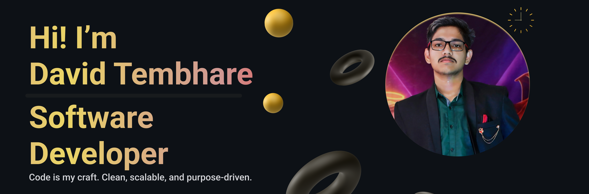

  

<h3 align="center">I am 1st year B.tech(CSE) Undergraduate Student.

- 🔭 I’m currently working on **DSA in C++ & Web Development**

- 🌱 I’m currently learning **C++** & **React**

- 👨‍💻 My LeetCode Profile -   <a href="https://www.leetcode.com/david-2610" target="blank">LEETCODE</a>

- 📫 How to reach me **davidtembhare1005@gmail.com**

<h3 align="center">Connect With Me </h3>

  
  
  

 

<h3 align="left">Languages and Tools:</h3>

   

              
